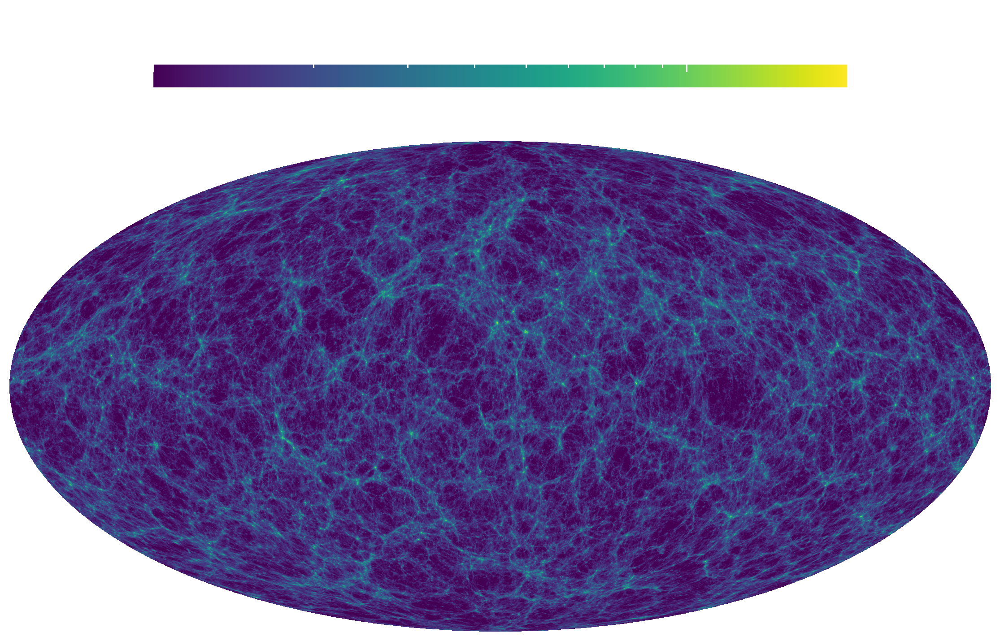

# Mapping SPH Data to an allsky HealPix map

You can also use `SPHtoGrid.jl` to do allsky projections of your simulations.
Here is an example of this for one of the simulations of the [LOCALIZATION](https://localization.ias.universite-paris-saclay.fr/) project [(Dolag et. al. 2023)](https://ui.adsabs.harvard.edu/abs/2023arXiv230210960D/abstract) :



## Single core mapping

You can construct healpix maps on a single core with

```@docs
healpix_map
```

Example:

```julia
using GadgetIO, GadgetUnits
using SPHtoGrid, SPHKernels

# helper function to get maps
function T_maps_of_file(snap_file)

    # read all data
    blocks = ["POS", "MASS", "HSML", "RHO", "U"]
    data = Dict( block => read_block(snap_file, block, parttype=0) for block ∈ blocks )

    # convert to physical code units
    h = GadgetIO.read_header(snap_file)
    GU = GadgetPhysical(h)

    pos = data["POS"] .* GU.x_physical
    hsml = data["HSML"] .* GU.x_physical
    rho = data["RHO"] .* GU.rho_physical
    mass = data["MASS"] .* GU.m_physical

    # convert to cgs units
    T_K = data["U"] .* GU.T_K

    # define map parameters
    kernel = WendlandC4(2)
    Nside = 1024

    # position the observer at the center of the box
    center = 0.5h.boxsize .* ones(3) .* GU.x_physical
    # map a 10 Mpc slide at a distance of 5 Mpc
    radius_limits = [5_000.0, 15_000.0]

    map, w_map = healpix_map(pos, hsml, mass, rho, T_K, rho, show_progress=true;
        center, kernel, Nside, radius_limits)

    return map, w_map
end

# run the map making
allsky, weights = mapping_function()

# reduce the image 
@inbounds for i ∈ eachindex(allsky)
    if !isnan(weights[i]) && !iszero(weights[i]) && !isinf(weights[i])
        allsky[i] /= weights[i]
    end
end

# save the map
saveToFITS(allsky, allsky_filename)
```

## Multi core mapping

Usually these allsky maps are performed over whole boxes that may consist of multiple sub-snapshots.
To allow for a parallel execution there's a helper function

```@docs
distributed_allsky_map
```

Example:

```julia
# we run this example on a SLURM cluster
using Distributed, ClusterManagers
addprocs_slurm(parse(Int64, ENV["SLURM_NTASKS"]))

@everywhere using GadgetIO, GadgetUnits
@everywhere using SPHKernels, SPHtoGrid
@everywhere using Base.Threads

# helper function for the mapping
@everywhere function T_maps_of_subfile(subfile)

    println("T: subfile $subfile running on $(nthreads()) threads")
    flush(stdout); flush(stderr)

    # read data and convert units
    h = GadgetIO.read_header(snap_file)
    GU = GadgetPhysical(h)

    hsml = read_block(snap_base * ".$subfile", "HSML", parttype=0) .* GU.x_physical
    rho = read_block(snap_base * ".$subfile", "RHO", parttype=0) .* GU.rho_physical
    mass = read_block(snap_base * ".$subfile", "RHO", parttype=0) .* GU.rho_physical
    T_K   = read_block(snap_base * ".$subfile", "U", parttype=0) .* GU.T_K
    pos  = read_block(snap_base * ".$subfile", "POS", parttype=0) .* GU.x_physical

    # define map parameters
    kernel = WendlandC4(2)
    Nside = 1024

    # position the observer at the center of the box
    center = 0.5h.boxsize .* ones(3) .* GU.x_physical
    # map a 10 Mpc slide at a distance of 5 Mpc
    radius_limits = [5_000.0, 15_000.0]

    # run the mapping
    allsky, weights  = healpix_map(pos, hsml, mass, rho, T_K, rho, show_progress=true; 
                        center, kernel, Nside, radius_limits)

    # important! de-allocate data to avoid memory overflow!
    pos = nothing
    hsml = nothing
    rho = nothing
    mass = nothing
    T_K = nothing
    kernel = nothing
    Nside = nothing
    center = nothing
    radius_limits = nothing
    # manually run garbage collector
    GC.gc()

    # return map
    return allsky, weights
end

Nside = 1024
Nsubfiles = 1024
filename = "T_allsky.fits"

# this function takes care of mapping, image reduction
distributed_allsky_map(filename, Nside, Nsubfiles, T_maps_of_subfile, reduce_image=true)
```